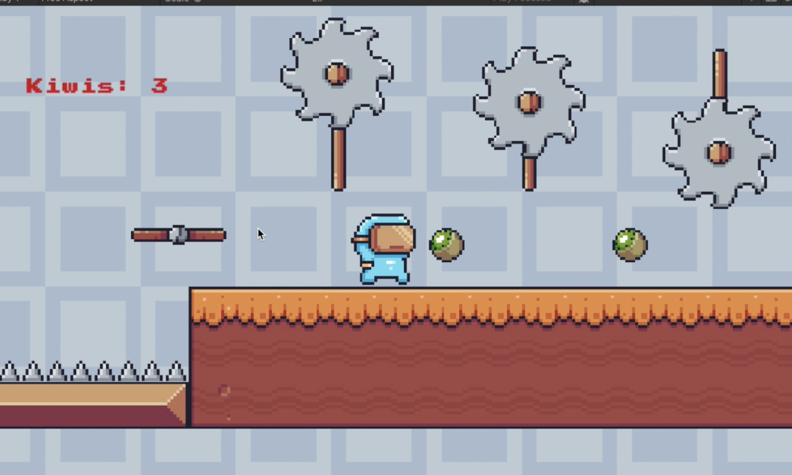
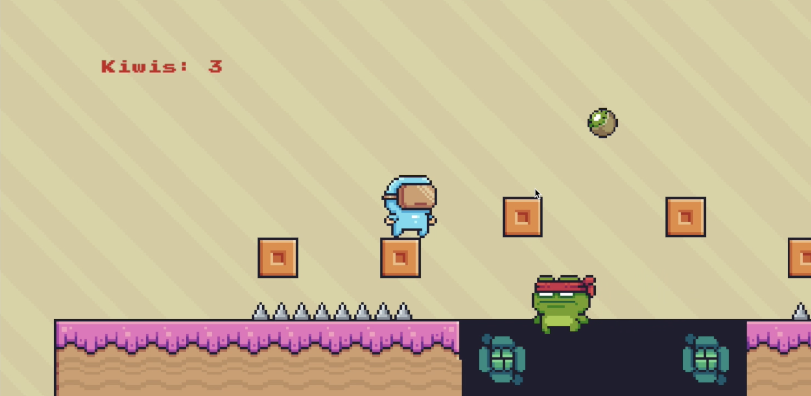
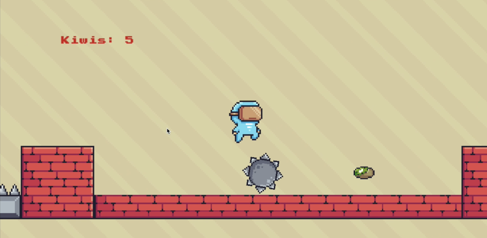

# Astro-Run

Astro-Run is a dynamic runner game built with Unity and C#, featuring multiple levels each presenting unique obstacles and enemies. Designed to offer an immersive gaming experience, Astro-Run challenges players with strategic gameplay and creative level designs, using Unity's powerful development tools to ensure smooth and responsive controls.

## Features

- **Multiple Levels:** Each level introduces different challenges and obstacles, keeping the gameplay exciting and unpredictable.
- **Responsive Controls:** Crafted to provide a seamless gaming experience with intuitive and responsive player controls.
- **Immersive Experience:** Engaging graphics and sound effects that keep players hooked.
- **Enemy Varieties:** Each level features unique enemies that require players to adapt their strategies.

## Usage

To play Astro-Run, use the arrow keys to move the character and spacebar to jump. Avoid obstacles and enemies to reach the end of each level.

